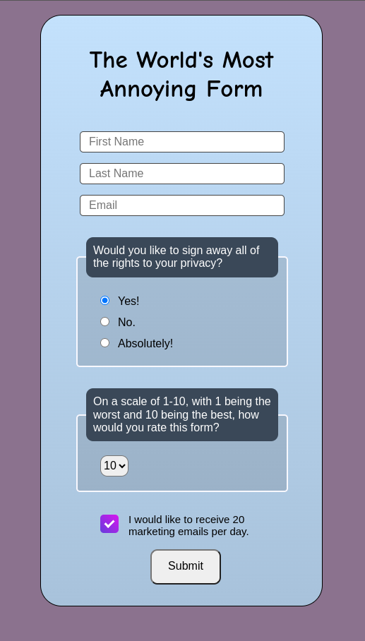
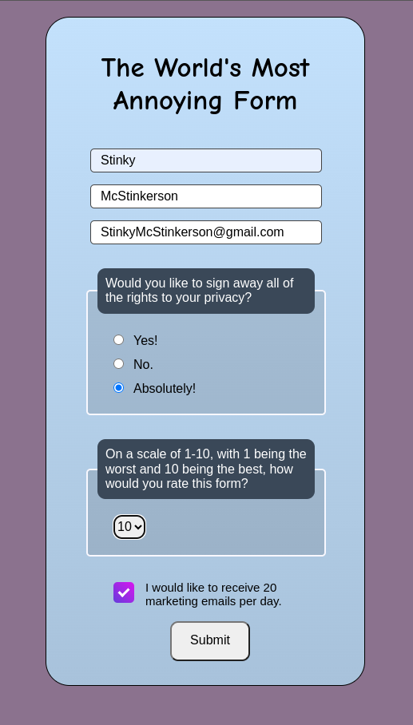

# The World's Most Annoying Form

https://the-world-most-annoying-form.netlify.app/

> This project is The World's Most Annoying Form, whatever you type or write this will come just its own name, last name, and email.



+ Here you can't select No :-(



------


## Before you Begin 🛠 🔨

Quick start:

```
$ npm install
$ npm run dev
$ npm start
```

```
$ pnpm install
$ pnpm run dev
$ pnpm start
```

Head over to https://vitejs.dev/ to learn more about using vite


## Cloning the project 🪛🔨

```
# Clone this repository
$ git clone https://github.com/MastooraTurkmen/react-form-project.git

# Go inside the repository
$ cd react-form-project
```


## Languages and Tools are used

1. **Languages**
    + [HTML](https://github.com/topics/html)
    + [HTML5](https://github.com/topics/html5)
    + [CSS](https://github.com/topics/css)
    + [CSS3](https://github.com/topics/css3)
    + [React](https://github.com/topics/react)
    + [JavaScript](https://github.com/topics/javascript)

2. **Tools**
    + [Chrome](https://github.com/topics/chrome)
    + [VSCode](https://github.com/topics/vscode)
    + [Figma](https://github.com/topics/figma)
